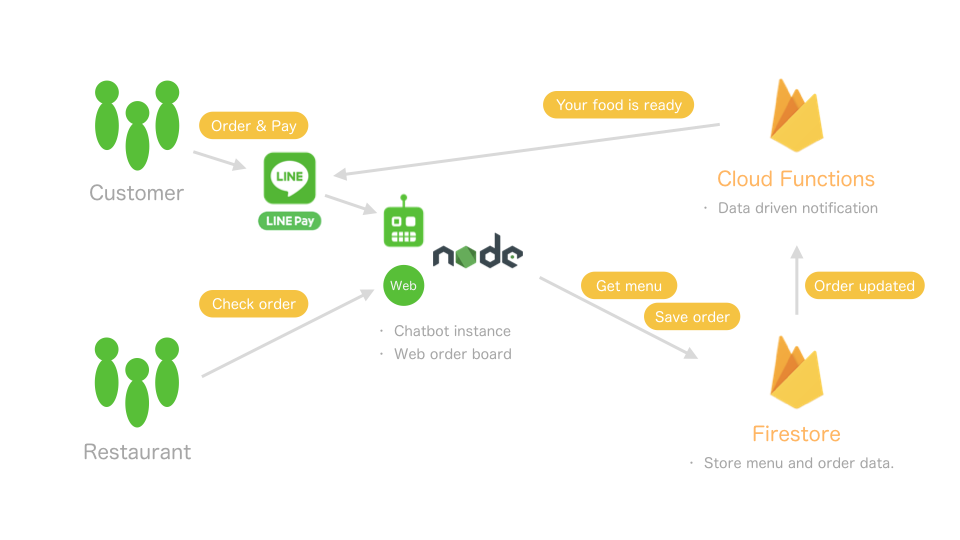

# Overview

A chatbot for table order including payment and order board for restaurant staff. 

# Architecture



# Getting started

- Add chatbot as friend by following QR code.


# Required LIFF App

| Environment variable | Size | URL |
| -- | -- | -- |
| LIFF_LINE_PAY | compact | /liff/line_pay
| LIFF_STRIPE | tall | /liff/stripe

# Required Richmenu

| Environment variable | Image | Configuration |
| -- | -- | -- |
| RICHMENU_CONTROL_PANEL | [control_panel.png](./richmenu/control_panel.png) | [Bot Designer data](./richmenu/control_panel.lbd)

# How to deploy

- Create LINE Messaging API Channel.
- Create Richmenu.
- Create LIFF applications.
- Create LINE Pay sandbox.
- (Optional) Create Stripe account.
- Create dialogflow agent.
- Create project for firestore.

- Clone this repository.

```
$ git clone https://github.com/nkjm/table-order.git
```

- Install dependencies.

```
cd table-order/
$ npm install
```

- Create .env file which configures following environment variables.

```
$ vi .env
```

- Deploy to cloud functions.

```
$ firebase deploy --only functions
```

- Start server. *You can use any process manager.*

```
$ npm start
```

### Required environment variables

- ASK_PAYMENT_METHOD - "enable" to ask payment method. Otherwise, LINE Pay is selected by default.
- BOT_EXPRESS_ENV - "test" for local development. "production" for production.
- BOT_LANGUAGE - Set mother language of this chatbot. ex. "ja"
- DEBUG - For testing, "bot-express:*". For production, "bot-express:chat,bot-express:skill-status" is recommended.
- DEFAULT_SKILL - "robot_response"
- FIREBASE_API_KEY - Credential for firestore.
- FIREBASE_CLIENT_EMAIL - Credential for firestore.
- FIREBASE_PRIVATE_KEY - Credential for firestore.
- FIREBASE_PROJECT_ID - Credential for firestore.
- GOOGLE_CLIENT_EMAIL - Credential for dialogflow.
- GOOGLE_PRIVATE_KEY - Credential for dialogflow.
- GOOGLE_PROJECT_ID - Credential for dialogflow.
- LIFF_LINE_PAY - LIFF App Id.
- LIFF_STRIPE - LIFF App Id.
- LINE_BOT_CHANNEL_ID - Channel Id of Messaging API.
- LINE_BOT_CHANNEL_SECRET - Channel Secret of Messaging API.
- LINE_PAY - Whether to enable LINE Pay or not. Supported values are "enable" and "disable".
- LINE_PAY_CHANNEL_ID - Channel Id of Pay API.
- LINE_PAY_CHANNEL_SECRET - Channel Secret of Pay API.
- LINE_PAY_CONFIRM_URL - Confirm URL of Pay API.
- LINE_PAY_ENV - For testing, "sandbox". For production, "production".
- MEMORY_RETENTION - Secons to retain context.
- REDIS_URL - Redis URL.
- RICHMENU_CONTROL_PANEL - Default Richmenu Id.
- STRIPE_API_KEY - API key of stripe
- STRIPE_CHECKOUT_CALLBACK_CANCEL - Callback URL in case of checkout failure.
- STRIPE_CHECKOUT_CALLBACK_SUCCESS - Callback URL in case of checkout succeed.
- STRIPE_CHECKOUT_SIGNATURE_SECRET= Stripe credential for the webhook.
- STRIPE_SECRET_KEY - Private key of stripe.
- TZ - Timezone ex."Asia/Tokyo"

# LICENSE

[MIT](./LICENSE)

---
Copyright 2019 Kazuki Nakajima